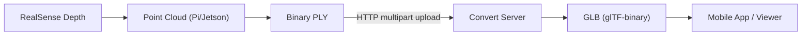

# ssafy-Oops — RealSense 기반 3D Foot Scanner (PointCloud → PLY → GLB)

Intel **RealSense**로 발(족형)의 **포인트 클라우드(Point Cloud)** 를 생성하고, 이를 **PLY**로 저장/업로드한 뒤 서버에서 **GLB(glTF-binary)** 로 변환해 앱에서 바로 확인할 수 있도록 만든 3D 스캐닝 파이프라인입니다.

> 이 README는 포트폴리오 관점에서, **내가 담당한 파트**(스캔 바이너리/포인트클라우드 생성 + PLY→GLB 변환)를 중심으로 정리했습니다.  
> - 담당: `./depth_cam` 전체(**FastAPI 오케스트레이터 `scanner_service.py` 제외**), `./backend/ply2gltf.py`

---

## 맡은 파트 (Portfolio Focus)

### 1) RealSense 스캔 바이너리 (C++17) — `depth_cam/`
- RealSense 깊이 스트림을 받아 **포인트 클라우드 생성**
- 턴테이블(ESP32)과 연동해 **다각도 스캔(360°) 누적**
- 누적 포인트를 **Binary PLY(Little-Endian)** 로 저장
- (옵션) libcurl로 **서버에 PLY 업로드**(multipart `file`)

관련 파일
- 빌드/링크: `depth_cam/CMakeLists.txt`
- 엔트리포인트(스캔/저장/업로드): `depth_cam/src/main.cpp`
- 좌표 변환/포인트 생성: `depth_cam/include/pointcloud.h`
- PLY 저장: `depth_cam/include/ply_writer.h`
- 모터(ESP32) 제어: `depth_cam/include/motor.h` (Bluetooth RFCOMM)
- 디버깅 유틸:
  - `depth_cam/rs_raw_dump.cpp` : depth scale/intrinsics 확인 및 raw dump
  - `depth_cam/serial_test.cpp` : UART 통신 테스트

### 2) PLY → GLB 변환 파이프라인 — `backend/ply2gltf.py`
- 업로드된 PLY(포인트클라우드)를 정제해서 **메쉬화(재구성)**
- 최종 결과를 **GLB**로 export (Flutter/웹에서 바로 렌더 가능)
- 포인트클라우드 품질 편차(노이즈, 테이블 평면, outlier)에 대응하도록
  - 다운샘플링 / 노이즈 제거 / 테이블 제거 / 클러스터링 / Poisson 재구성 / 디메시피케이션 / 노말/와인딩 보정까지 포함

---

## 전체 파이프라인 개요



- Edge(라즈베리파이/Jetson)에서는 **스캔/PLY 생성**까지 수행
- 서버(EC2 등)에서는 계산량이 큰 **메쉬 재구성/GLB 변환**을 담당  
  → Edge 성능 제약을 회피하고 전체 UX(대기시간/발열)를 줄이는 구조

---

## depth_cam — 구현 상세

### 스캔 동작 (회전 누적)
`footscan` 바이너리는 아래 흐름으로 동작합니다.

1) RealSense depth stream 활성화  
- 해상도: `848x480`, 포맷 `Z16`, `30fps`  
- `depth_scale`(raw → meter)와 intrinsics(`fx, fy, cx, cy`)를 런타임에 획득

2) 프레임 수(`--frames N`)에 따라 턴테이블을 `360/N`도씩 회전하며 스캔  
- 모터 제어는 `motor::rotate_to_deg(step_deg)`로 ESP32에 각도 명령 전송  
- 각 단계에서 depth frame을 스냅샷으로 복사해 처리 (`copyDepthData`)

3) depth → world XYZ 변환 후 누적  
- pixel(u,v)과 depth(Zm)를 pinhole 모델로 카메라 좌표계 XYZ로 변환
- 이후 월드 좌표계로 회전/이동 변환을 적용해 **턴테이블 중심 기준**으로 정렬
  - `Rx(-90°)` 고정 보정
  - `Rx(pitch)` (카메라 pitch)
  - `Rz(yaw + 90°)` (회전 각도)
  - translation: `(R*cos(yaw), R*sin(yaw), cam_height)`
- 깊이 필터: `[z_min, z_max]` (기본 `z_min=0`, `z_max=threshold_cm/100`)  
  → 테이블/배경 노이즈를 1차적으로 억제

4) PLY 저장 (Binary Little-Endian)
- `write_ply_binary_le()`로 vertex-only `(x,y,z)` float32를 기록  
  → 파일 크기/업로드 비용을 줄이고, 서버 파이프라인(Open3D)에 바로 투입 가능

### 왜 “턴테이블 중심 좌표계”인가?
다각도 스캔은 결국 “여러 뷰를 하나로 합치기” 문제인데,  
각 프레임을 턴테이블 중심 좌표계로 사전에 정렬해두면

- 뷰 정합(ICP 등) 부담을 줄이고
- 후처리(테이블 제거/클러스터링/메쉬화)가 안정적이며
- 서버 변환 단계에서 “발만 남기기”가 쉬워집니다.

---

## backend/ply2gltf.py — 구현 상세

### 변환 파이프라인 요약
`process_ply_to_glb()`는 아래 단계를 거쳐 GLB를 생성합니다.

1) Load PLY (`open3d.io.read_point_cloud`)  
2) Voxel Downsample (기본 `0.002m`)  
3) Statistical Outlier Removal (`nb_neighbors`, `std_ratio`)  
4) 테이블 제거  
- 빠른 Z-cut 옵션(`table_z_cut_eps`) 또는  
- RANSAC 평면 분리(`segment_plane`)로 테이블 inlier 제거  
5) DBSCAN 클러스터링 → **가장 큰 클러스터(발)만 유지**  
6) 법선 추정 및 정렬 (`estimate_normals`, `orient_normals_consistent_tangent_plane`)  
7) Poisson 재구성 → Triangle Mesh 생성  
8) 밀도(density) 기반 trimming + 메쉬 클린업 + 큰 컴포넌트만 유지  
9) 스무딩/디메시피케이션(옵션)  
10) 좌표 회전(기본 `(-90°, 0, 0)`) + **와인딩(outward winding) 보정**  
11) Trimesh로 GLB export (`tmesh.export(file_type='glb')`)

### 와인딩 보정이 필요한 이유
Poisson 결과는 법선 방향이 뒤집히는 경우가 있어, GLB 뷰어에서 **백페이스만 보이는 현상**이 발생할 수 있습니다.  
`_ensure_outward_winding()`에서 “메쉬 중심 기준으로 삼각형 노말이 바깥을 향하는지”를 검사하고, 필요하면 triangle winding을 뒤집어 렌더 안정성을 확보했습니다.

---

## 빌드 & 실행

### 1) footscan 빌드 (depth_cam)
의존성
- `librealsense2` (RealSense SDK)
- `libcurl`
- `bluetooth` (RFCOMM)

```bash
cd depth_cam
mkdir -p build && cd build
cmake .. -DCMAKE_BUILD_TYPE=Release
cmake --build . -j
```

### 2) 스캔 실행 예시
```bash
./footscan   --frames 40   --threshold_cm 40   --pitch_deg -15   --radius_m 0.25   --cam_height_m 0.00   --out scan.ply
```

- `--radius_m`는 필수(턴테이블 중심 ↔ 카메라 거리)
- ESP32 모터 제어를 쓰는 경우 `depth_cam/include/motor.h`의 `FIXED_MAC`을 실제 MAC으로 설정해야 합니다.

### 3) PLY → GLB (로컬 CLI)
```bash
cd backend
python3 ply2gltf.py --input ../depth_cam/build/scan.ply --out foot.glb
```

---

## 트러블슈팅 / 운영 팁

- **RealSense 권한/연결**
  - 장치 인식이 안 되면 udev rule/권한, 케이블, 전원 등을 먼저 확인하세요.
- **모터 연결(Bluetooth)**
  - `motor.h`의 MAC/채널이 올바르지 않으면 회전 명령이 실패합니다.
  - 회전이 불안정하면 `--frames` 값을 낮춰 스캔 시간을 줄이고, 서버에서 후처리(스무딩/디메시피케이션)로 품질을 보완하는 전략이 유효합니다.
- **메쉬 품질 튜닝**
  - 포인트가 너무 거칠면 `voxel_size`를 줄이고(`0.002 → 0.0015`)
  - 노이즈가 많으면 `stat_std_ratio`를 낮추거나(`3.5 → 2.5`),
  - 테이블 제거가 불안정하면 `table_z_cut_eps`와 RANSAC를 함께 튜닝하세요.

---

## 기술 스택

- **Edge / Scanner**: C++17, librealsense2, libcurl, Bluetooth RFCOMM
- **Geometry Processing**: Open3D, NumPy, Trimesh
- **Output Format**: PLY (Binary LE), GLB (glTF-binary)
